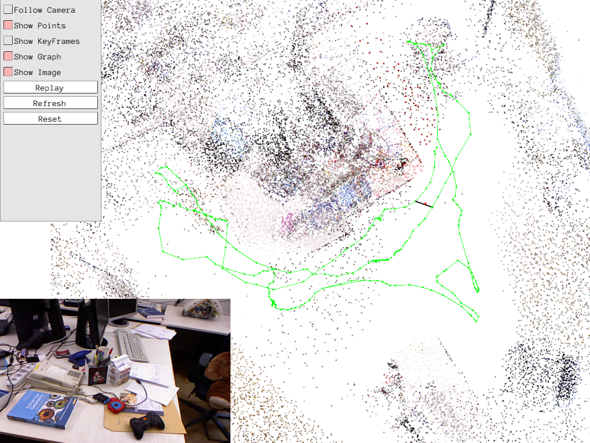
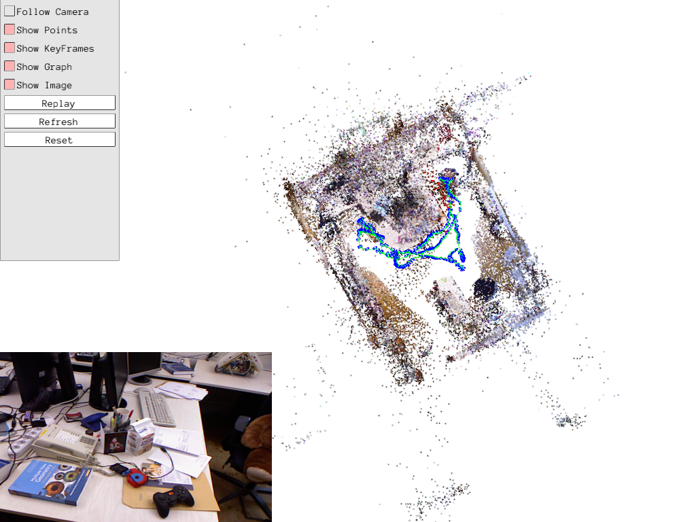

# rgbd_ptam

This is a python implementation of RGBD-PTAM, the code is modified from [stereo_ptam](https://github.com/uoip/stereo_ptam), which is based on C++ project [lrse/sptam](https://github.com/lrse/sptam) and paper "S-PTAM: Stereo Parallel Tracking and Mapping" Taihu Pire et al. RAS17.    

> RGBD-PTAM is a RGBD SLAM system able to compute the camera trajectory in real-time. It heavily exploits the parallel nature of the SLAM problem, separating the time-constrained pose estimation from less pressing matters such as map building and refinement tasks. On the other hand, the RGBD setting allows to reconstruct a metric 3D map for each frame, improving the accuracy of the mapping process with respect to monocular SLAM and avoiding the well-known bootstrapping problem. Also, the real scale of the environment is an essential feature for robots which have to interact with their surrounding workspace.   

RGB-D system has direct depth measurements, by setting a pasudo stereo baseline, disparity can be computed from depth, then stereo measurements can be synthetized. Now the problem is converted to stereo SLAM, we can directly reuse S-PTAM's solution and [stereo_ptam](https://github.com/uoip/stereo_ptam)'s code. Below is S-PTAM's system overview (from [S-PTAM paper](http://webdiis.unizar.es/~jcivera/papers/pire_etal_ras17.pdf) page 11):    

Because one RGB-D frame has only one image, the computation burden is smaller than stereo setting, actually this project is faster than [stereo_ptam](https://github.com/uoip/stereo_ptam), reach 30~50ms per frame (depending on keyframes adding frequency).   

## Features 
- [x] Multithreads Tracking, Mapping, and Loop Closing
- [x] Covisibility Graph
- [x] Local Bundle Adjustment
- [x] Pose Graph Optimization
- [x] Motion Model
- [x] Visualization
- [x] Data loader for datasets [TUM RGB-D](https://vision.in.tum.de/data/datasets/rgbd-dataset) and [ICL-NUIM RGB-D](https://www.doc.ic.ac.uk/~ahanda/VaFRIC/iclnuim.html)
- [ ] Relocalization (tracking failure recovery)
- [ ] Dense point clouds visualization
- [ ] Exhaustive evaluation

## Requirements
* Python 3.6+
* numpy
* cv2
* [g2o](https://github.com/uoip/g2opy) (python binding of C++ library [g2o](https://github.com/RainerKuemmerle/g2o)) for optimization
* [pangolin](https://github.com/uoip/pangolin) (python binding of C++ library [Pangolin](http://github.com/stevenlovegrove/Pangolin)) for visualization

## Usage
`python ptam.py --dataset tum --path path/to/your/TUM_RGBD_dataset/rgbd_dataset_freiburg1_room`  
or  
`python ptam.py --dataset icl --path path/to/your/ICL-NUIM_RGBD_dataset/living_room_traj3_frei_png`

## Results
Visual results on TUM-RGBD dataset sequence "rgbd_dataset_freiburg1_room":   
* graph:    
   
* point cloud (sparse):   

## License
Following [stereo_ptam](https://github.com/uoip/stereo_ptam), this project is released under GPLv3 License. 

## Contact
If you have problems related to the base S-PTAM algorithm, you can contact original authors [lrse](https://github.com/lrse) (robotica@dc.uba.ar), or refer to the paper:  
[1]  Taihú Pire,Thomas Fischer, Gastón Castro, Pablo De Cristóforis, Javier Civera and Julio Jacobo Berlles.
**S-PTAM: Stereo Parallel Tracking and Mapping**
Robotics and Autonomous Systems, 2017.  

If you have interest in this python implementation, email me (Hang Qi, qihang@outlook.com);